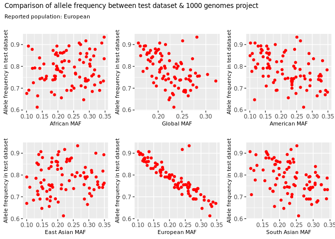
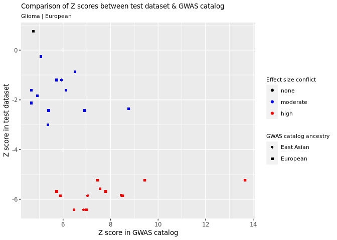
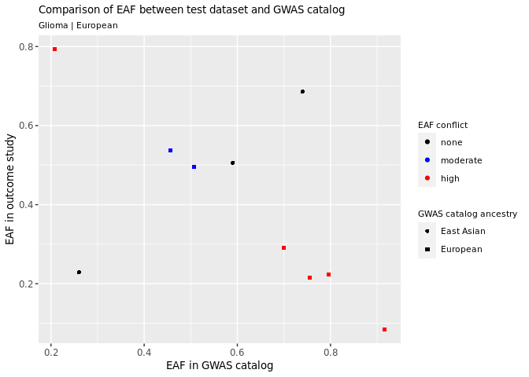
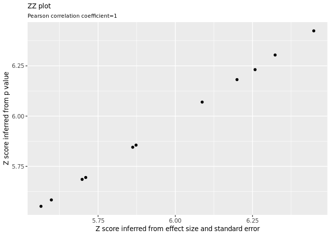
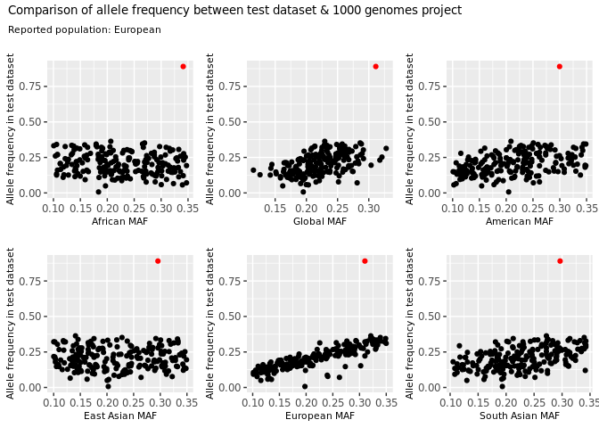
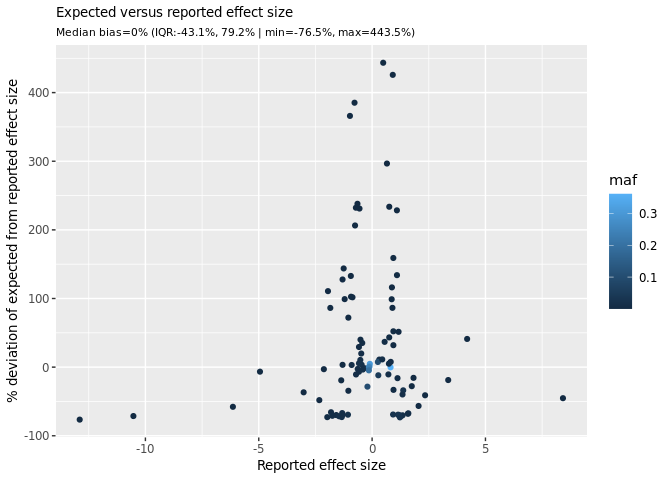
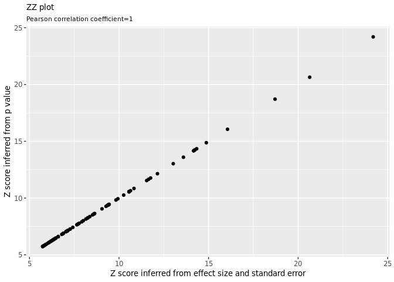

<!-- README.md is generated from README.Rmd. Please edit that file -->
# CheckSumStats

<!-- badges: start -->
<!-- badges: end -->
CheckSumStats is an R package for checking the accuracy of meta- and summary-data from genetic association studies prior to their use in post-GWAS applications, such as two-sample Mendelian randomisation. For example, the package provides tools for checking that the reported effect allele and effect allele frequency columns are correct. It also checks for possible errors in the reported effect sizes that might introduce bias into downstream analyses. The package was developed for the Fatty Acids in Cancer Mendelian Randomization Collaboration (FAMRC). See our pre-print describing application of the package here: [Design and quality control of large-scale two-sample Mendelian randomisation studies](https://www.medrxiv.org/content/10.1101/2021.07.30.21260578v1)

## Installation

To install the latest version of CheckSumStats, perform as normal:

``` r
install.packages("devtools")
devtools::install_github("MRCIEU/CheckSumStats")
```

## General overview

This package exploits three groups of single nucleotide polymorphisms (SNPs) in order to identify potential errors or issues:

1.  **a 1000 genomes reference set**. This is a set of 2297 SNPs that have the same minor allele across the 1000 genomes super populations and that have a minor allele frequency between 0.1 and 0.3;
2.  **GWAS catalog associations**. These are SNPs that are associated with the trait of interest in the GWAS catalog; and
3.  the **test GWAS top hits**. These are SNPs that are strongly associated with the trait of interest in the target GWAS of interest.

Our objective is to extract summary data for these three groups of SNPs from the target GWAS of interest (we call this the test dataset) in order to perform the following quality control checks:

1.  confirm the identity of the effect allele frequency column
2.  confirm the identity of the effect allele column
3.  identify possible errors in the reported effect sizes
4.  infer ancestry

# Example 1. Glioma GWAS

In this example we show how the package can be used to check the quality of reported summary and metadata from a case-control genome-wide association study of glioma. In this particular example, the effect allele column was mis-labelled as the non-effect allele.

## Step 1. Extract and format the outcome summary data for glioma

The first step is to map the reported trait with the Experimental Factor Ontology (EFO).

``` r
library(CheckSumStats)
EFO<-get_efo(trait="glioma")
EFO
#> $efo_id
#> [1] "EFO_0000326" "EFO_0005543"
#> 
#> $confidence
#> [1] "confidence:GOOD"
```

Then we make a list of SNP rsids.

``` r
snplist<-make_snplist(efo_id=EFO$efo_id,trait="glioma",ref1000G_superpops=TRUE)
```

We now have a list of SNPs that include known genetic associations for glioma in the GWAS catalog as well as a 1000 genomes reference set. The number of reported genetic associations for glioma in the GWAS catalog is:

``` r
length(snplist)-2297 
#> [1] 75
```

Next, we extract the summary associations statistics for these SNPs from the glioma dataset using the extract\_snps() function.

``` r
File<-system.file("extdata", "glioma_test_dat.txt", package = "CheckSumStats")
gli<-extract_snps(snplist=snplist,path_to_target_file=File,path_to_target_file_sep="\t")
```

In the above example, we extracted the summary data for the SNPs of interest from a tab separated text file that was stored on our local machine. In practice the File object is just the file path to your GWAS results. Note that the extract\_snps() function only works on MAC/linux machines. Alternatively, you could use the read.table() function to load all the summary data into R and then extract the SNPs of interest. Another alternative is to source the summary data from online databases, such as the Open GWAS project (<https://gwas.mrcieu.ac.uk/>). For example, the equivalent scripts to extract summary data for thyroid cancer from Open GWAS are:

``` r
EFO<-get_efo(trait="thyroid cancer")
snplist<-make_snplist(efo_id = EFO$efo_id,trait="thyroid carcinoma")
thy <- ieugwasr::associations(id="ieu-a-1082", variants=snplist,proxies=0)  
```

Returning to the glioma example, having extracted the summary data for some SNPs, we now need to format the summary data. This is to get the data into the expected format for the QC tests to come.

``` r
Dat<-format_data(dat=gli,outcome="Glioma",population="European",pmid=22886559,study="GliomaScan",ncase="cases",ncontrol="controls",rsid="Locus",effect_allele="Allele1",other_allele="Allele2",or="OR",or_lci="OR_95._CI_l",or_uci="OR_95._CI_u",eaf="eaf.controls",p="p",efo="glioma")
```

In this example, the glioma results file contained columns for the odds ratio and 95% confidence intervals. In practice, the format of the effect size columns is highly variable across studies. For example, some studies may report the log odds ratio and its standard error or the odds ratio and P value without confidence intervals or a standard error. The format\_data() function accepts these and other effect size reporting formats. See ?format\_data() for more info.

Now we are ready to perform some quality checks on the summary data

## Step 2. Check allele frequency metadata for the glioma GWAS

Next we create some plots to visualise potential problems with the effect allele frequency column. We do this by comparing allele frequency in the glioma dataset to the 1000 genomes super populations. The function harmonises the test and reference dataset to reflect the minor allele in the 1000 genomes superpopulations. Therefore, the presence of SNPs with allele frequency \> 0.5 in the test dataset implies an allele frequency metadata error.

``` r
Plot1<-make_plot_maf(ref_1000G=c("AFR","AMR","EAS","EUR","SAS","ALL"),target_dat=Dat)
Plot1
```



Data points with a red colour are SNPs with allele frequency conflicts. Allele frequencies in the glioma dataset are all greater than 0.5, indicating that the reported allele frequency column in the glioma dataset does not correspond to the reported effect allele. Notice also how conflicts are flagged across all SNPs across all superpopulations. This illustrates that allele frequency metadata errors can be identified without matching of test and reference datasets on ancestry. Notice also how the comparison provides information on the ancestral background of the test dataset: the test dataset is strongly correlated with the European 1000 genomes super population.

## Step 3. Check the effect allele metadata

We next check that the reported effect allele metadata is correct, by comparing the reported effect alleles for glioma to the GWAS catalog.

``` r
Dat1<-Dat
Plot2<-make_plot_gwas_catalog(dat=Dat,efo_id =EFO$efo_id,trait="glioma")
Plot2
```



Each datapoint represents the Z score for glioma risk for a single SNP (scaled to reflect the reported effect allele in the GWAS catalog). The Y and X axes represent the Z scores in the test and GWAS catalog datasets, respectively. For most SNPs, the allele associated with higher risk in the GWAS catalog is associated with lower risk in the test dataset. We call these discrepancies "effect size conflicts" and it is a very strong indication for an effect allele metadata error, i.e. the reported effect allele is actually the non-effect allele. When comparing datasets, its important to make allowance for chance deviations in effect direction, especially for test datasets generated in small sample sizes. For this reason, effect size conflicts are labelled as high if the two-sided P value for the Z score is ≤0.0001 and as moderate if \>0.0001 (this is a pragmatic cutoff). When comparing datasets, one should also consider the number of SNPs. Effect size conflicts are more likely to reflect metadata errors when they are systematic across a large number of SNPs.

We can also make a plot comparing effect allele frequency between the test dataset and the GWAS catalog, which we show in the next example.

``` r
Plot3<-make_plot_gwas_catalog(dat=Dat,plot_type="plot_eaf",efo=unique(Dat$efo),trait=unique(Dat$outcome))
Plot3
```



We see an inverse correlation in *reported* effect allele frequency (EAF) between the test dataset and the GWAS catalog in European ancestry studies, which confirms the metadata error identified in the previous plot. In the absence of effect allele metadata errors, the correlation in allele frequency should be positive (assuming the datasets are matched on ancestry). The reported effect allele frequency is opposite to what wed expect based on the GWAS catalog - e.g. the top left red datapoint has a frequency close to 0.8 in the test dataset but frequency of 0.2 in the GWAS catalog. We call these discrepancies EAF conflicts. EAF conflicts are labelled as moderate if EAF is close to 0.5 (i.e. 0.4 to 0.6) and as high if \<0.4 or \>0.6. This makes allowance for chance deviations in allele frequency. When making comparisons with the GWAS catalog its important to consider whether the datasets are matched on ancestry (however, this consideration does not apply for comparisons with our customised 1000 genomes reference dataset, see step 2 above).

## Step 4. Check for effect sizes errors in the glioma GWAS

We next compare the expected and reported effect sizes. In this example we include two groups of SNPs: those associated with glioma in the GWAS catalog ("GWAS catalog associations") and those associated with glioma in the test dataset ("test GWAS top hits"). Typically these two sets of SNPs will strongly overlap but this is not necessarily always the case (and lack of overlap is itself a sign of potential problems). First, we make a list of SNPs corresponding to the GWAS catalog associations. Then we use the extract\_snps() function to extract those SNPs. We also set the argument "get\_sig\_snps" to TRUE, which tells the function to extract GWAS significant SNPs from the test dataset (default p value is 5e-8). Alternatively to the extract\_snps() function, you could use read.table() to read in your GWAS results file and then extract the two sets of SNPs. We then generate the expected effect sizes. Since the reported effect sizes correspond to log odds ratios, we generate the expected log odds ratio using the predict\_lnor\_sh() function. This function was developed by [Sean Harrison](https://seanharrisonblog.com/2020/04/11/estimating-an-odds-ratio-from-a-gwas-only-reporting-the-p-value)

``` r
File<-system.file("extdata", "glioma_test_dat.txt", package = "CheckSumStats")
snplist<-make_snplist(efo_id=EFO$efo_id,trait="glioma",ref1000G_superpops=FALSE)
gli<-extract_snps(snplist=snplist,path_to_target_file=File,path_to_target_file_sep="\t",get_sig_snps=TRUE, p_val_col_number=7)
Dat<-format_data(dat=gli,outcome="Glioma",population="European",pmid=22886559,study="GliomaScan",ncase="cases",ncontrol="controls",rsid="Locus",effect_allele="Allele1",other_allele="Allele2",or="OR",or_lci="OR_95._CI_l",or_uci="OR_95._CI_u",eaf="eaf.controls",p="p",efo="glioma")
Pred<-predict_lnor_sh(dat=Dat)
Plot4<-make_plot_pred_effect(dat=Pred)
Plot4
```


The plot shows a strong positive correlation between the expected and reported effect sizes, an intercept close to zero and a slope that is close to 1. This is reasonably close to what wed expect to see in the absence of major analytical issues. The "arachidonic acid" GWAS provides a counter example ([Example 2](#example_2)).

Note that the predict\_lnor\_sh can be quite slow, so you may want to clump your results prior to using, especially if you have \>100 SNPs. Below is how you could clump your results using the ieugwasr package.

``` r
Clump<-ieugwasr::ld_clump(clump_r2 = 0.01,clump_p=1e-8,dplyr::tibble(rsid=Dat$rsid, pval=Dat$p, id=Dat$id),pop="EUR")
Dat<-Dat[Dat$rsid %in% Clump$rsid,]
Pred<-predict_lnor_sh(dat=Dat)
Plot4<-make_plot_pred_effect(dat=Pred)
```

We can also plot the relative bias, i.e. the percentage deviation of the expected from the reported effect size.

``` r
Plot5<-make_plot_pred_effect(dat=Pred,bias=TRUE)
Plot5
```

 Overall the relative bias seems small and mostly varies from -10.9% to -13.8%, which seems reasonable. Given that genetic effect sizes tend to be small, a relative bias of 10% will be very small on an absolute scale (e.g. scaling an odds ratio of 1.10 up by 10% is 1.11).

## Step 5. Check that the top hits in the glioma test dataset are reported in the GWAS catalog

Next we check that the "top hits" for glioma in the test dataset are reported in the GWAS catalog. We define top hits as SNP-trait associations with P values \< 5e-8, a conventional threshold for statistical significance in GWAS. First we extract the top hits, using the extract\_sig\_snps() function but, alternatively, you could use the read.table() function to read in your entire dataset and then extract the top hits. If the top hits are not reported in the GWAS catalog this could be a sign of false positives in the test dataset, which in turn could be a sign of technical problems (such as failure to exclude low quality variants), although there may be alternative explanations. By default, the function searches the GWAS catalog for all genetic variants within 25,000 base pairs of the "top hit". In the example, below we search the GWAS catalog for all genetic associations for glioma that are within 50,000 base pairs of our top hits (distance\_threshold set to 50000).

``` r
File<-system.file("extdata", "glioma_test_dat.txt", package = "CheckSumStats")
gli<-extract_sig_snps(path_to_target_file=File,p_val_col_number=7)
Dat<-format_data(dat=gli,outcome="Glioma",population="European",pmid=22886559,study="GliomaScan",ncase="cases",ncontrol="controls",rsid="Locus",effect_allele="Allele1",other_allele="Allele2",or="OR",or_lci="OR_95._CI_l",or_uci="OR_95._CI_u",eaf="eaf.controls",p="p",efo="glioma")
gc_list<-find_hits_in_gwas_catalog(gwas_hits=Dat$rsid,efo_id=EFO$efo_id,distance_threshold=50000) 
#> Using GRCh38.p13 of human genome from ensembl for genomic coordinates
#> Using GRCh38.p13 of human genome from ensembl for genomic coordinates
gc_list
#> $not_in_gc
#> character(0)
#> 
#> $in_gc
#>  [1] "rs2736100"  "rs2853676"  "rs10120688" "rs1063192"  "rs1412829" 
#>  [6] "rs2151280"  "rs2157719"  "rs7049105"  "rs4977756"  "rs6010620" 
#> [11] "rs6089953"
```

All the top hits for glioma in the test dataset are either associated with glioma in the GWAS cataog or are in close physical proximity to a reported association for glioma (see $in\_gc).

## Step 6. Check whether the reported P values correspond to the reported effect sizes in the glioma dataset

Next we generate some ZZ plots, in order to flag SNPs with P values that dont coincide with their reported effect sizes. The zz\_plot() function compares Zp scores (inferred from the reported P values) to Zb scores (inferred from the reported effect size and standard error).

``` r
Plot6<-zz_plot(dat=Dat)
Plot6
```



## Step 6. Combine all plots into a single report for the glioma GWAS

Next we combine all the plots into a single report.

``` r
Plot_list2<-ls()[grep("Plot[0-9]",ls())] 
Plot_list<-lapply(1:length(Plot_list2),FUN=function(x) eval(parse(text=Plot_list2[x])))
combine_plots(Plot_list=Plot_list,out_file="~/qc_report.png")
```


# <a id="example_2"></a> Example 2. Check the summary and meta data from a GWAS of arachidonic acid.

In this example we use the package to check the summary and metadata from a genome-wide association study of arachidonic acid that has not gone through standad post-GWAS QC (e.g. with low quality or unreliable genetic variants excluded).

## Step 1. Extract and format the summary data for arachidonic acid

``` r
library(CheckSumStats)
EFO<-get_efo(trait="arachidonic acid measurement")
EFO
#> $efo_id
#> [1] "EFO_0006808"
#> 
#> $confidence
#> [1] "confidence:MEDIUM"

snplist<-make_snplist(efo_id=EFO$efo_id,trait="Plasma omega-6 polyunsaturated fatty acid levels (arachidonic acid)",ref1000G_superpops=TRUE)
File<-system.file("extdata", "ara_test_dat.txt", package = "CheckSumStats")
ara<-extract_snps(snplist=snplist,path_to_target_file=File)
Dat<-format_data(dat=ara,outcome="arachidonic acid",population="European",pmid=24823311,study="CHARGE",ncontrol="n",UKbiobank=FALSE,rsid="snp",effect_allele="effect_allele",other_allele="other_allele",beta="beta",se="se",eaf="effect_allele_freq",p="p")
```

## Step 2 Check allele frequency metadata for arachidonic acid GWAS

``` r
Plot1<-make_plot_maf(ref_1000G=c("AFR","AMR","EAS","EUR","SAS","ALL"),target_dat=Dat)
Plot1
```



For the vast majority of SNPs, allele frequencies are compatible between the test dataset and 1000 genomes superpopulations. This indicates that the reported allele frequency column corresponds to the effect allele.

## Step 3. Check effect allele metadata for arachidonic acid

``` r
Plot2<-make_plot_gwas_catalog(dat=Dat,efo_id=EFO$efo_id,trait="Plasma omega-6 polyunsaturated fatty acid levels (arachidonic acid)",beta="beta",se="se",Title = "Comparison of associations in the GWAS catalog to the test dataset")
Plot2
```


Most SNPs appear to have concordant effect sizes between the test dataset and the GWAS catalog. Although there are a few SNPs with effect sizes in opposite directions, the Z scores for these SNPs are small and therefore compatible with chance deviations. This suggests that the reported effect allele is correct.

## Step 4. Check for errors in the reported effect sizes in the arachidonic acid GWAS

Next, we check the summary data for possible effect size errors. For this step, we extract summary data for "top hits" in the test dataset.

``` r
File<-system.file("extdata", "ara_test_dat.txt", package = "CheckSumStats")
ara<-extract_sig_snps(path_to_target_file=File,p_val_col_number=7)
Dat<-format_data(dat=ara,outcome="arachidonic acid",population="European",pmid=24823311,study="CHARGE",ncontrol="n",UKbiobank=FALSE,rsid="snp",effect_allele="effect_allele",other_allele="other_allele",beta="beta",se="se",eaf="effect_allele_freq",p="p")
dim(Dat)
#> [1] 1064   19
```

1064 SNPs were extracted. Its useful to clump the results to ensure independence and for speed. We call the ieugwasr package to perform the clumping.

``` r

Clump<-ieugwasr::ld_clump(clump_r2 = 0.01,clump_p=1e-8,dplyr::tibble(rsid=Dat$rsid, pval=Dat$p, id=Dat$id),pop="EUR")
#> API: public: http://gwas-api.mrcieu.ac.uk/
#> Please look at vignettes for options on running this locally if you need to run many instances of this command.
#> Using access token. For info on how this is used see logging_info()
#> ℹ 2021-08-20 15:14:57 > Setting client.id from options(googleAuthR.client_id)
#> → Using an auto-discovered, cached token
#>   To suppress this message, modify your code or options to clearly consent to
#>   the use of a cached token
#>   See gargle's "Non-interactive auth" vignette for more details:
#>   <https://gargle.r-lib.org/articles/non-interactive-auth.html>
#> → The googleAuthR package is using a cached token for 'philip.haycock@gmail.com'
#> Clumping , 1064 variants, using EUR population reference
#> Removing 969 of 1064 variants due to LD with other variants or absence from LD reference panel
Dat<-Dat[Dat$rsid %in% Clump$rsid,]
```

Now we generate expected effect sizes and plot these against the reported effect size.

``` r
Dat<-predict_beta_sd(dat=Dat)
Plot3<-make_plot_pred_effect(dat=Dat,pred_beta = "beta_sd",pred_beta_se="se_sd",beta="beta",se="se")
Plot3
```


We see a slope of 0.548 and non-linear correlation pattern, indicating that the SNPs have unusual effect sizes. This patterm of results is compatible with the presence of potential false positives in the test dataset, which in turn may reflect problems with the post-GWAS cleaning of the summary statistics. We can also plot the relative bias - the relative deviation of the reported from the expected effect sizes.

``` r
Plot4<-make_plot_pred_effect(dat=Dat,pred_beta = "beta_sd",pred_beta_se="se_sd",beta="beta",se="se",bias=TRUE)
Plot4
```



The SNPs with the most bias tend to have lower minor allele frequencies, confirming possible problems with the post-GWAS cleaning of the results file. Next, we check how many of the top hits for arachidonic acid in the test dataset are present in the GWAS catalog.

``` r
gc_list<-find_hits_in_gwas_catalog(gwas_hits=Dat$rsid,efo_id=EFO$efo_id,trait="Plasma omega-6 polyunsaturated fatty acid levels (arachidonic acid)",distance_threshold=50000) 
#> Using GRCh38.p13 of human genome from ensembl for genomic coordinates
#> Ensembl site unresponsive, trying uswest mirror
#> Using GRCh38.p13 of human genome from ensembl for genomic coordinates
gc_list
#> $not_in_gc
#>  [1] "rs10026364" "rs10488885" "rs10819512" "rs10938476" "rs10986188"
#>  [6] "rs11726352" "rs12238732" "rs12416578" "rs12456907" "rs12639648"
#> [11] "rs12888839" "rs12894905" "rs12955978" "rs13128117" "rs13268288"
#> [16] "rs13381393" "rs16940996" "rs16943026" "rs16951711" "rs16974991"
#> [21] "rs17060495" "rs17568699" "rs1887892"  "rs2192242"  "rs2826490" 
#> [26] "rs3088245"  "rs340480"   "rs4359352"  "rs4818759"  "rs7080747" 
#> [31] "rs7093714"  "rs7226534"  "rs7231821"  "rs727887"   "rs7292052" 
#> [36] "rs7456249"  "rs7690731"  "rs7778698"  "rs7904736"  "rs12747494"
#> [41] "rs10788947" "rs10798816" "rs957129"   "rs11578575" "rs7546429" 
#> [46] "rs12037648" "rs6658106"  "rs12623171" "rs6750701"  "rs13386900"
#> [51] "rs13314643" "rs13325952" "rs16851412" "rs11917725" "rs17077488"
#> [56] "rs11958171" "rs279412"   "rs5745104"  "rs13178241" "rs10040997"
#> [61] "rs1432985"  "rs781980"   "rs9275354"  "rs13191761" "rs9356335" 
#> [66] "rs12523734" "rs6456902"  "rs11752402" "rs2294281"  "rs9375065" 
#> [71] "rs12285167" "rs487023"   "rs7933136"  "rs2903922"  "rs930786"  
#> [76] "rs760306"   "rs11824358" "rs890455"   "rs10830946" "rs259874"  
#> [81] "rs11833369" "rs7970058"  "rs4931549"  "rs11147144" "rs7137292" 
#> [86] "rs12297743" "rs11107024" "rs2653765"  "rs16959795" "rs16985879"
#> [91] "rs4614987"  "rs6060682" 
#> 
#> $in_gc
#> [1] "rs174528" "rs472031" "rs1741"

Plot5<-make_plot_gwas_catalog(dat=Dat,efo_id=EFO$efo_id,trait="Plasma omega-6 polyunsaturated fatty acid levels (arachidonic acid)",force_all_trait_study_hits=TRUE,beta="beta",se="se",Title = "Comparison of top hits in test dataset to GWAS catalog")
#> Using GRCh38.p13 of human genome from ensembl for genomic coordinates
#> Using GRCh38.p13 of human genome from ensembl for genomic coordinates

Plot5
```


92 of 95 top hits in the test dataset do not overlap with associations for arachidonic acid in the GWAS catalog. Taken together with the non-linear relationship between the expected and reported effect sizes, this suggests a large number of false positives, which in turn may reflect problems with the post-GWAS cleaning of the summary statistics. Correspondence with the data provider confirmed that the GWAS summary statistics had not gone through post GWAS filtering of low quality variants (e.g. exclusion of SNPs with low minor allele frequency or low imputation r2 scores). Once we obtained a cleaned dataset (with low quality SNPs excluded), the aforementioned discrepancies were resolved.

## Step 5. Check whether the reported P values correspond to the reported effect sizes (arachidonic acid example)

Finally, we check whether the reported P values correspond to the reported effect sizes.

``` r
Plot6<-zz_plot(dat=Dat,beta="beta",se="se")
Plot6
```

 We see a very close concordance between the reported P-values and reported effect sizes.

## Step 6. Combine all plots into a single report (arachidonic acid example)

Lets combine all the key figures into a single report

``` r
Plot_list2<-c("Plot1","Plot2","Plot3","Plot4","Plot5","Plot6")
Plot_list<-lapply(1:length(Plot_list2),FUN=function(x) eval(parse(text=Plot_list2[x])))
combine_plots(Plot_list=Plot_list,out_file="~/qc_report2.png")
```


# Acknowledgements

We gratefully acknowledge the help of Ramiro Magno for their help and advice with the gwasrapidd package.

\*CheckSumStats greatfully acknowledges the following packages:

    gwasrapidd
    ggplot2
    grid
    gridExtra
    cowplot
    grDevices
    ieugwasr
    knitr
    biomaRt
    purrr
    dplyr
    tibble
    magrittr
    curl
    plyr
    utils
    +stats
