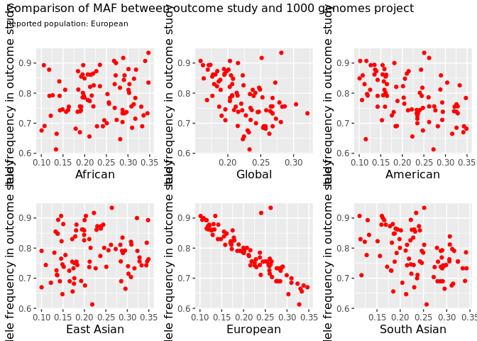

<!-- README.md is generated from README.Rmd. Please edit that file -->

# mrQC

<!-- badges: start -->

<!-- badges: end -->

mrQC is an R package for checking the accuracy of meta- and summary-data
for outcome traits prior to their use in Mendelian randomisation
analyses. For example, the package provides tools for checking that the
reported effect allele and effect allele frequency columns are correct.
It also checks for possible errors in the summary data that might
introduce bias into downstream Mendelian randomisation analyses.

## Installation

To install the latest version of mrQC, perform as normal:

``` r
install.packages("devtools")
devtools::install_github("MRCIEU/mrQC")
```

## General overview

This package exploits three groups of SNPs: 1) **the MAF 1KG reference
set**. This a set of 2297 SNPs that have the same minor allele across
the 1000 genomes super populations and that have a minor allele
frequency between 0.1 and 0.3. These SNPs are used to check for allele
frequency errors; 2) **the GWAS catalog top hits**. These are SNPs in
the GWAS catalog that are strongly associated with the outcome trait of
interest; and 3) the **exposure SNPs** or the genetic instruments for
the exposure of interest.

The package performs 4 types of checks:

1)  confirm the identity of the effect allele column. This step relies
    on comparison of GWAS catalog top hits.  
2)  confirm the identity of the effect allele frequency column. This
    step relies on comparison of the MAF reference set.  
3)  assess the ancestral origins of a study. This step relies on
    comparison of the MAF reference set.  
4)  for case-control studies, confirm that the provided effect sizes are
    log odds ratios or identify potential summary data errors. This step
    can use any of the SNP sets.

## Step 1. Extract and format the target data

The first step is to make a list of SNP rsids. Let’s assume our outcome
trait of interest is glioma. Let’s identify the top GWAS hits for glioma
in the GWAS catalog. We will search on both the reported trait name as
well as the trait experimental factor ontology (EFO). Note that not all
studies in the GWAS catalog have up-to date EFO annotations. It is
therefore advisable to search on both efo and reported trait, to
maximise the number of retrieved hits.

``` r
library(mrQC)
snplist<-make_snplist(efo="glioma",trait="glioma",ref1000G_superpops=FALSE) #search on EFO abd reported trait 
head(snplist)
#> [1] "rs2736100" "rs2853676" "rs891835"  "rs4295627" "rs4977756" "rs498872"
length(snplist)
#> [1] 54
```

We see that searching on the glioma EFO and glioma trait retrieves 54
unique SNP rsids. We could also have searched on the glioma efo\_id,
which retrieves the same SNPs as searching on the “glioma” efo.

``` r
snplist<-make_snplist(efo_id="EFO_0005543",ref1000G_superpops=FALSE) 
```

In the above examples we set ref1000G\_superpops to FALSE. We now set
this to TRUE, which will result in a SNP list that includes the “MAF
reference set”. This is a set of 2297 SNPs that have the same minor
allele across all 1000 genomes super populations and a minor allele
frequency of
0.1-0.3.

``` r
snplist<-make_snplist(efo="glioma",trait="glioma",ref1000G_superpops=TRUE) 
head(snplist)
#> [1] "rs2736100" "rs2853676" "rs891835"  "rs4295627" "rs4977756" "rs498872"
length(snplist)
#> [1] 2351
```

We can also define a set of “exposure SNPs” and include this in list of
rsids. For example, let’s assume we are conducting a Mendelian
randomisation study to assess the effect of polyunsaturated fatty acid
exposure on risk of glioma. Let’s define the “exposure SNPs”, or genetic
instrument, as SNPs associated with polyunsaturated fatty acids with a P
value \<5e-8. Let’s use the ieugwasr package to extract “exposure SNPs”
for polyunsaturated fatty acids from the Open GWAS project and also add
these to the other SNPs.

``` r
instruments<-ieugwasr::tophits(id="met-d-PUFA",pval = 5e-08)
#> API: public: http://gwas-api.mrcieu.ac.uk/
snplist<-make_snplist(efo = "glioma",trait="glioma",ref1000G_superpops=TRUE,snplist_user=instruments$rsid)
head(snplist)
#> [1] "rs2736100" "rs2853676" "rs891835"  "rs4295627" "rs4977756" "rs498872"
length(snplist)
#> [1] 2417
```

Our SNP list now contains the rsids for: 1) the GWAS catalog top hits,
2) the MAF reference set and 3) the “exposure SNPs”. Next, we extract
the summary associations statistics for these SNPs from the glioma
outcome dataset. The example below has already been restricted to the
SNPs of interest to save space. The extract\_snps function only works on
MAC or linux operating systems.

``` r
File<-system.file("extdata", "glioma_test_dat.txt", package = "mrQC")
gli<-extract_snps(snplist=snplist,path_to_target_file=File,path_to_target_file_sep="\t")
dim(gli)
#> [1] 115  16
head(gli)
#>       Locus Allele1 Allele2         MAF                Geno_Counts  Subjects
#> 1 rs6010620       G       A 0.229|0.175  2969|1698|287/1254|554|48 4954|1856
#> 2 rs2736100       G       T 0.506|0.437 1211|2465|1273/594|900|360 4949|1854
#> 3 rs2157719       A       G 0.450|0.511 1508|2428|1013/454|905|495 4949|1854
#> 4 rs4977756       A       G 0.423|0.481  1669|2374|908/509|905|438 4951|1852
#> 5 rs2853676       G       A 0.250|0.311  2795|1835|321/874|808|172 4951|1854
#> 6 rs2297440       C       T 0.223|0.175  2668|1458|244/1039|455|42 4370|1536
#>          p     OR OR_95._CI_l OR_95._CI_u CHROMOSOME LOCATION controls cases
#> 1 1.13e-10 0.7009      0.6289      0.7812         20 61780283     4954  1856
#> 2 4.28e-09 0.7722      0.7082      0.8420          5  1339516     4949  1854
#> 3 4.57e-09 1.2936      1.1866      1.4102          9 22023366     4949  1854
#> 4 1.21e-08 1.2831      1.1774      1.3982          9 22058652     4951  1852
#> 5 2.16e-08 1.3112      1.1922      1.4420          5  1341547     4951  1854
#> 6 1.49e-07 0.7278      0.6462      0.8198         20 61782743     4370  1536
#>   eaf.controls path_to_target_file
#> 1        0.229 glioma_test_dat.txt
#> 2        0.506 glioma_test_dat.txt
#> 3        0.450 glioma_test_dat.txt
#> 4        0.423 glioma_test_dat.txt
#> 5        0.250 glioma_test_dat.txt
#> 6        0.223 glioma_test_dat.txt
```

In the above example, the summary data for glioma was stored locally on
our machine in a tab separated text file. Alternatively, we could have
sourced the outcome summary data from the Open GWAS project
(<https://gwas.mrcieu.ac.uk/>). For example, to extract summary data for
thyroid cancer we could
run:

``` r
snplist<-make_snplist(efo = "thyroid carcinoma",trait="thyroid carcinoma",ref1000G_superpops=TRUE,snplist_user=instruments$rsid)
#> Warning in gwas_catalog_hits(trait = trait): search for trait - thyroid
#> carcinoma - returned 0 studies from the GWAS catalog
head(snplist)
#> [1] "rs965513"    "rs944289"    "rs966423"    "rs2439302"   "rs116909374"
#> [6] "rs6759952"
length(snplist)
#> [1] 2397
thy <- ieugwasr::associations(id="ieu-a-1082", variants=snplist,proxies=0)  
dim(thy)
#> [1] 146  12
thy
#> # A tibble: 146 x 12
#>        se position     n chr       p    beta id    rsid  ea    nea     eaf trait
#>     <dbl>    <int> <int> <chr> <dbl>   <dbl> <chr> <chr> <chr> <chr> <dbl> <chr>
#>  1 0.104    2.75e7  1187 12    0.826 -0.0229 ieu-… rs11… A     G     0.200 Thyr…
#>  2 0.0934   6.34e7  1187 3     0.526 -0.0592 ieu-… rs68… C     T     0.271 Thyr…
#>  3 0.0891   8.64e7  1187 4     0.754  0.0279 ieu-… rs46… G     A     0.676 Thyr…
#>  4 0.0953   9.20e6  1187 5     0.764 -0.0286 ieu-… rs14… G     A     0.256 Thyr…
#>  5 0.106    1.25e8  1187 10    0.354 -0.0977 ieu-… rs10… T     C     0.190 Thyr…
#>  6 0.104    1.26e7  1187 11    0.461  0.0768 ieu-… rs10… G     A     0.803 Thyr…
#>  7 0.119    8.15e6  1187 4     0.811  0.0286 ieu-… rs12… C     T     0.144 Thyr…
#>  8 0.0886   1.65e8  1187 4     0.717 -0.0321 ieu-… rs10… C     T     0.327 Thyr…
#>  9 0.104    1.24e8  1187 5     0.187  0.137  ieu-… rs48… T     C     0.802 Thyr…
#> 10 0.133    4.07e7  1187 8     0.400  0.112  ieu-… rs78… G     A     0.112 Thyr…
#> # … with 136 more rows
```

The make\_snplist() function returns a warning that no GWAS hits were
found when searching for thyroid carcinoma as the reported trait.
However the search was able to identify hits searching on the efo for
thyroid carcinoma.

Returning to the glioma example, having extracted the summary data for
the SNP rsids of interest, we now need to format the summary data. This
is to get the data into the expected format for the QC
functions.

``` r
Dat<-format_data(dat=gli,outcome="Glioma",population="European",pmid=22886559,study="GliomaScan",ncase="cases",ncontrol="controls",UKbiobank=FALSE,rsid="Locus",effect_allele="Allele1",other_allele="Allele2",or="OR",lci="OR_95._CI_l",uci="OR_95._CI_u",eaf="eaf.controls",p="p",efo="glioma")
head(Dat)
#>        rsid effect_allele other_allele         MAF                Geno_Counts
#> 1 rs6010620             G            A 0.229|0.175  2969|1698|287/1254|554|48
#> 2 rs2736100             G            T 0.506|0.437 1211|2465|1273/594|900|360
#> 3 rs2157719             A            G 0.450|0.511 1508|2428|1013/454|905|495
#> 4 rs4977756             A            G 0.423|0.481  1669|2374|908/509|905|438
#> 5 rs2853676             G            A 0.250|0.311  2795|1835|321/874|808|172
#> 6 rs2297440             C            T 0.223|0.175  2668|1458|244/1039|455|42
#>    Subjects        p     OR OR_95._CI_l OR_95._CI_u CHROMOSOME LOCATION
#> 1 4954|1856 1.13e-10 0.7009      0.6289      0.7812         20 61780283
#> 2 4949|1854 4.28e-09 0.7722      0.7082      0.8420          5  1339516
#> 3 4949|1854 4.57e-09 1.2936      1.1866      1.4102          9 22023366
#> 4 4951|1852 1.21e-08 1.2831      1.1774      1.3982          9 22058652
#> 5 4951|1854 2.16e-08 1.3112      1.1922      1.4420          5  1341547
#> 6 4370|1536 1.49e-07 0.7278      0.6462      0.8198         20 61782743
#>   ncontrol ncase   eaf path_to_target_file       lnor         se     pmid
#> 1     4954  1856 0.229 glioma_test_dat.txt -0.3553901 0.05532116 22886559
#> 2     4949  1854 0.506 glioma_test_dat.txt -0.2585117 0.04414629 22886559
#> 3     4949  1854 0.450 glioma_test_dat.txt  0.2574290 0.04404068 22886559
#> 4     4951  1852 0.423 glioma_test_dat.txt  0.2492790 0.04384619 22886559
#> 5     4951  1854 0.250 glioma_test_dat.txt  0.2709427 0.04852824 22886559
#> 6     4370  1536 0.223 glioma_test_dat.txt -0.3177290 0.06070188 22886559
#>   outcome population      study UKbiobank effect_allele_confirmed open_gwas
#> 1  Glioma   European GliomaScan     FALSE                   FALSE     FALSE
#> 2  Glioma   European GliomaScan     FALSE                   FALSE     FALSE
#> 3  Glioma   European GliomaScan     FALSE                   FALSE     FALSE
#> 4  Glioma   European GliomaScan     FALSE                   FALSE     FALSE
#> 5  Glioma   European GliomaScan     FALSE                   FALSE     FALSE
#> 6  Glioma   European GliomaScan     FALSE                   FALSE     FALSE
#>      efo efo_id
#> 1 glioma     NA
#> 2 glioma     NA
#> 3 glioma     NA
#> 4 glioma     NA
#> 5 glioma     NA
#> 6 glioma     NA
```

Now we are ready to perform some quality checks on the summary data

## Step 2. Check that the effect allele frequency column is correct

Next we create some plots to visualise potential problems with the
effect allele frequency column. We do this by comparing allele frequency
in the outcome glioma dataset to the 1000 genomes super populations.
Let’s restrict the comparison to the European super population, since
we know that the glioma dataset was derived from a European ancestry
population.

``` r
Plot1<-make_plot_maf(ref_1000G="EUR",target_dat=Dat)
Plot1
```


SNPs with a red colour are SNPs with incompatible minor allele
frequencies, i.e. the allele frequencies are above 0.5 in the target
dataset but less than 0.5 in the 1000 genomes dataset. In this example,
all SNPs are flagged as problematic and there is a strong inverse
correlation in minor allele frequency between the datasets. This
indicates that the reported effect allele frequency column, in the
outcome dataset, does not correspond to the reported effect allele. The
strong inverse correlation implies that the effect allele column
actually refers to the non-effect allele.

Next we construct a similar plot but this time comparing allele
frequency with all 1000 genomes super
populations.

``` r
Plot2<-make_plot_maf(ref_1000G=c("AFR","AMR","EAS","EUR","SAS","ALL"),target_dat=Dat)
Plot2
```



All SNPs across all super populations are flagged as problematic. This
illustrates that the function can identify problematic SNPs regardless
of the ancestry of the outcome dataset. We also see a strong inverse
correlation in the comparison with the European 1000 genomes super
population. This is not surprising, since we know that the the glioma
GWAS results were generated in a European ancestry population. This
illustrates that the strength of the correlation in MAF between the
datasets can also support inferences about the ancestral background of
the outcome dataset, although the function was not designed with this
objective in mind. A more efficient approach would be to select SNPs
with a much wider range of variation in minor allele frequency that
chosen here.

## Step 3. Check that the effect allele column is correct

We next compare effect alleles between the glioma outcome dataset and
the GWAS catalog, in order identify potential mis-specification of the
effect allele
column.

``` r
Plot3<-make_plot_gwas_catalog(dat=Dat,efo=unique(Dat$efo),trait="glioma")
Plot3
```


We see that there are three groups of SNPs: those flagged as showing no
effect size conflict; those with moderate effect size conflict; and
those with high effect size conflict. The distinction between moderate
and high effect size conflict is arbitrary but is specified to make
allowance for chance deviations between datasets. If the effect sizes
are in opposite directions, the effect size conflict flag is set to
moderate or high. If the two-sided P value in both datasets is ≤0.0001
then the flag is upgraded to high. In addition, if the summary
association statistics in the target dataset and GWAS catalog are
derived from the same publication, and effect sizes are in opposite
directions, the conflict flag is set to high regardless of P value.

Overall, the plot shows that the majority of SNPs show effect size
conflicts. In other words, SNPs associated with higher risk of glioma in
the GWAS catalog tend to be associated with lower risk of glioma in the
target dataset. This indicates that the reported effect allele column
may actually correspond to the non-effect allele. Taken together with
the previous allele frequency plots, showing an inverse correlation in
MAF between the target dataset and 1000 genomes European
superpopulation, this strongly indicates that the effect and non-effect
allele columns have been incorrectly specified. The reported non-effect
allele column is actually the effect allele column.

We can also make a plot comparing effect allele frequency between the
target dataset and the GWAS catalog, which we show in the next example.

``` r

Plot4<-make_plot_gwas_catalog(dat=Dat,plot_type="plot_eaf",efo=unique(Dat$efo),trait=unique(Dat$outcome))
```

We see an inverse correlation in effect allele frequency (EAF) between
the target dataset and the GWAS catalog in European ancestry studies.
This is the expected pattern when the effect allele column has been
incorrectly specified and reflects the non-effect allele. The EAF
conflict flag is set to moderate or high if EAF is not consistently
greater or less than 0.5 in the target dataset and the GWAS catalog
(e.g. is \<0.5 in the target dataset but is \>0.5 in the GWAS catalog).
For conflicting SNPs, the flag is upgraded to high if effect allele
frequency is \>0.6 or \<0.4. This makes allowance for chance deviations
in allele frequency for SNPs with MAF close to 0.5.

In the next example, we compare the predicted log odds ratio to the
reported effect size. This step is applicable to summary data that has
been derived from a logistic regression model of case-control status.
Since the function to derive the predicted log odds ratio can be a bit
slow, we restrict the glioma example to just the first 20
SNPs.

## Step 4. Check whether the reported effect size corresponds to log odds ratios

``` r
Dat1<-Dat[1:20,]
Pred<-predict_lnor_sh(dat=Dat1)
Plot5<-make_plot_predlnor(dat=Pred)
Plot5
```

The plot shows a strong positive correlation between the predicted and
reported log odds ratio. This is expected. What’s more useful is the
intercept and the slope, which are displayed as part of the figure
subheading. In this example, the intercept is close to zero and the
slope is \>0.8, which is close to the expected values. When the
predicted and reported log odds ratios are identical, the intercept
should be 0 and the slope should be 1.

We can also plot the bias, i.e. the deviation of the predicted log odds
ratio from the reported effect size.

``` r
Plot6<-make_plot_predlnor(dat=Pred,bias=TRUE)
Plot6
```

Overall the bias seems small and mostly varies from -10.9% to -13.5%,
although it does seem to get worse with stronger effect sizes. Since
genetic effect sizes tend to be quite small, a bias of 10% is unlikely
to make a material difference.

In the next example we show a dataset that returns a slope and intercept
very different from
expectation

``` r
snplist<-make_snplist(efo = "kidney cancer",snplist_user=instruments$rsid)
ukb <- data.frame(ieugwasr::associations(id="ukb-b-1316", variants=snplist,proxies=0),stringsAsFactors=FALSE)
Ukb<-format_data(dat=ukb,outcome="Kidney cancer",population="European",pmid="ukb-b-1316",ncase=1114,ncontrol=461896,study="UKB",UKbiobank=TRUE,rsid="rsid",effect_allele="ea",other_allele="nea",lnor="beta",se="se",eaf="eaf",p="p",effect_allele_confirmed=TRUE,all_summary_stats=TRUE,ID=145,efo = "kidney cancer")
Pred<-predict_lnor_sh(dat=Ukb)
Plot5_2<-make_plot_predlnor(dat=Pred)
Plot5_2
```

Unsurprisingly there is a strong positive correlation. However, the
slope is 400, when we expect a slope of 1. In fact, further
investigation reveals that Open GWAS dataset ukb-b-1316 has been
generated using a linear mixed model. In other words, the results were
derived from a model where kidney cancer case-control status (controls
coded 1 and cases coded 2) was regressed on SNP genotype (additively
coded). The effect size from this model can be interpreted as the
absolute risk of kidney cancer per copy of the effect allele. We can
transform this into a log odds ratio scale using the transform\_betas()
function.

``` r
Ukb2<-transform_betas(dat=Ukb,effect="lnor",effect.se="se")
Pred2<-predict_lnor_sh(dat=Ukb2)
Plot5_3<-make_plot_predlnor(dat=Pred2)
Plot5_3
```

After transforming the reported effect size to a log odds ratio scale,
we now see a slope close to 1 for the relationship with the predicted
log odds ratio. We suggest that any dataset with an unsual intercept or
with a slope very different from 1 (e.g. \<0.8 or \>1.2) should be
investigated by the user for potential problems. In the glioma example,
the slope and intercept look reasonably close to what we’d expect. In
the kidney cancer example, the slope was different from 1 because the
reported effect sizes had not been generated in a logistic regression
model. Other factors that could cause the slope to differ from 1
include: the impact of covariate adjustment in the original GWAS,
deviations from Hardy Weinberg equilibrium, mismatches between reported
and actual allele frequency or mismatches between reported and actual
SNP-level sample size.

Let’s now return back to the glioma dataset. In the next example we
generate ZZ plots, which can be used to flag SNPs with P values that
don’t coincide with their reported effect sizes. The zz\_plot()
function compares Zp scores (inferred from the reported P values) to Zb
scores (inferred from the reported effect size and standard error).

## Step 5. Check whether the P values correspond to the effect sizes

``` r
Plot7<-zz_plot(dat=Dat)
Plot7
```

The correlation between the Zp and Zb scores is 1, indicating very
strong concordance between the reported P values and reported effect
sizes in the glioma dataset for the selected SNPs. In the next example,
we highlight a dataset where the correlation is less than 1.

``` r
instruments<-ieugwasr::tophits(id="met-d-PUFA")
snplist<-make_snplist(efo = "lung carcinoma",snplist_user=instruments$rsid)
luc <- ieugwasr::associations(id="ieu-a-966", variants=snplist,proxies=0)  
Dat<-format_data(dat=data.frame(luc,stringsAsFactors=F),outcome="Lung cancer",population="European",pmid=24880342,ncase=11348,ncontrol=15861,study="ILCCO",UKbiobank=FALSE,rsid="rsid",effect_allele="ea",other_allele="nea",lnor="beta",se="se",eaf="eaf",p="p",efo = "lung carcinoma")
Plot7_2<-zz_plot(dat=Dat)
Plot7_2
```

The correlation between the Zp and Zb scores is less than 1, suggesting
discordance between the reported P values and reported effect sizes. In
the example, we included all three sets of SNP (the GWAS catalog hits,
the MAF reference set and the “exposure SNPs”. Let’s restrict the
comparison to only the “exposure SNPs” and the GWAS catalog top
hits.

``` r
snplist<-make_snplist(efo = "lung carcinoma",snplist_user=instruments$rsid,ref1000G_superpops=FALSE)
luc <- ieugwasr::associations(id="ieu-a-966",variants=snplist,proxies=0)  
Dat<-format_data(dat=data.frame(luc,stringsAsFactors=F),outcome="Lung cancer",population="European",pmid=24880342,ncase=11348,ncontrol=15861,study="ILCCO",rsid="rsid",effect_allele="ea",other_allele="nea",lnor="beta",se="se",eaf="eaf",p="p",efo = "lung carcinoma")
Plot7_3<-zz_plot(dat=Dat)
Plot7_3
```

The correlation between the Zp and Zb scores is still less than 1,
suggesting some discordance between the reported P values and reported
effect sizes. For example, 1 SNP has a Z score close to 15 when
estimated from the P value but a Z score close to 5 when estimated from
the reported effect size and standard error

## Step 6. Combine all plots into a single report

Next we combine all the plots into a single report that we can save for
later.

``` r
Plot_list2<-ls()[grep("Plot[0-9]",ls())] 
Plot_list<-lapply(1:length(Plot_list2),FUN=function(x) eval(parse(text=Plot_list2[x])))
combine_plots(Plot_list=Plot_list,out_file="~/qc_report.png")
knitr::opts_chunk$set(
  collapse = TRUE,
  comment = "#>",
  fig.path = "man/figures/qc_report.png"
```
