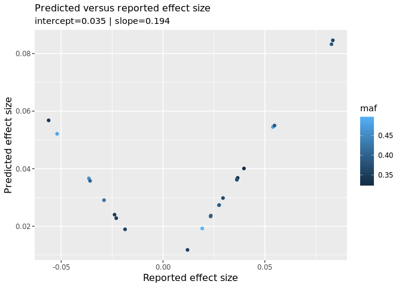
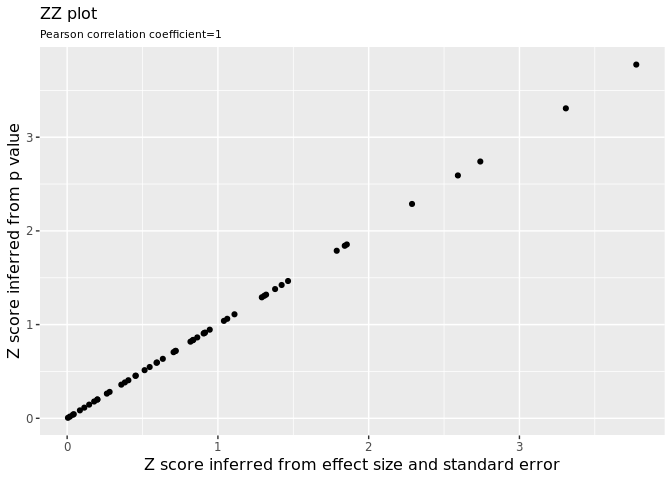
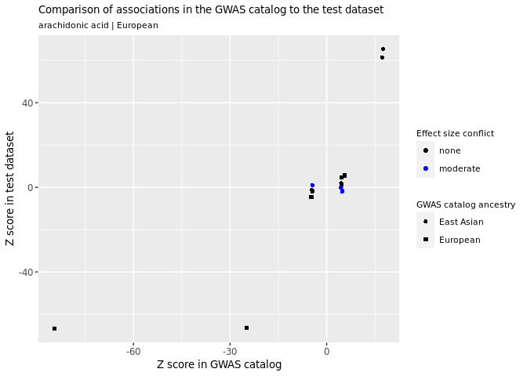
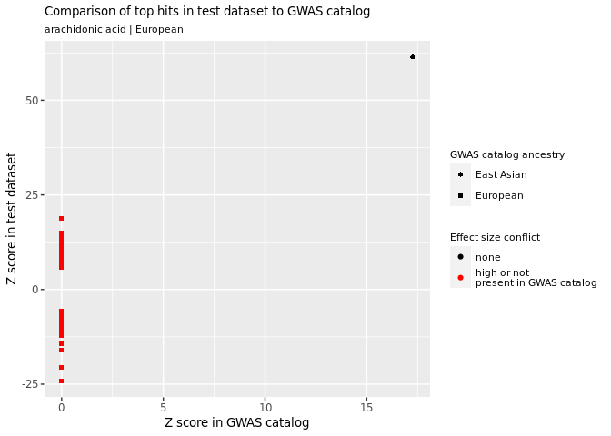

<!-- README.md is generated from README.Rmd. Please edit that file -->
# CheckSumStats

<!-- badges: start -->
<!-- badges: end -->
CheckSumStats is an R package for checking the accuracy of meta- and summary-data from genetic association studies prior to their use in post-GWAS applications, such as two-sample Mendelian randomisation. For example, the package provides tools for checking that the reported effect allele and effect allele frequency columns are correct. It also checks for possible errors in the reported effect sizes that might introduce bias into downstream analyses.

## Installation

To install the latest version of mrQC, perform as normal:

``` r
install.packages("devtools")
devtools::install_github("MRCIEU/CheckSumStats")
```

## General overview

This package exploits three groups of single nucleotide polymorphisms (SNPs) in order to identify potential errors or issues: 1) **A MAF 1KG reference set**. This is a set of 2297 SNPs that have the same minor allele across the 1000 genomes super populations and that have a minor allele frequency between 0.1 and 0.3; 2) **GWAS catalog top hits**. These are SNPs that are strongly associated with the trait of interest in the GWAS catalog; and 3) the **GWAS top hits**. These are SNPs that are strongly associated with the trait of interest in the GWAS or genetic association study of interest.

The package performs 4 types of checks:

1.  confirm the identity of the effect allele frequency column. This step relies on comparison of the MAF reference set between the GWAS study and the 1000 genomes reference dataset.
2.  confirm the identity of the effect allele column. This step relies on comparison of GWAS catalog top hits between the GWAS study and the GWAS catalog.
3.  assess the ancestral origins of the study. This step relies on comparison of the MAF reference set between the GWAS study and 1000 genomes reference dataset.
4.  identify possible errors in the reported effect sizes. This step exploits the GWAS top hits and the GWAS catalog top hits.

# Example 1. Check the summary and meta data from a disease GWAS

In this example we show how the package can be used to check the quality of reported summary and meta data from case-control genome-wide association studies. Example 2 focuses on genome-wide association studies of non-disease continuous traits.

## Step 1. Extract and format the outcome summary data

The first step is to make a list of SNP rsids. Let's assume our trait of interest is glioma. Let's identify the top GWAS hits for glioma in the GWAS catalog. We will search using both the reported trait name as well as the trait experimental factor ontology (EFO). It is advisable to search for both because not all studies in the GWAS catalog have up-to date EFO annotations. Searching for both therefore maximises the number of retrieved hits.

``` r
library(mrQC)
snplist<-make_snplist(efo="glioma",trait="glioma",ref1000G_superpops=FALSE)
head(snplist)
#> [1] "rs2736100" "rs2853676" "rs891835"  "rs4295627" "rs4977756" "rs498872"
length(snplist)
#> [1] 54
```

We see that searching on the glioma EFO and glioma trait retrieves 54 unique SNP rsids. We could also have searched on the glioma efo\_id (EFO\_0005543), which would have retrieved the same SNPs as searching on the "glioma" efo.

``` r
snplist<-make_snplist(efo_id="EFO_0005543",ref1000G_superpops=FALSE) 
```

In the above examples we set ref1000G\_superpops to FALSE. We now set this to TRUE, which will result in a SNP list that includes the "MAF reference set". This is a set of 2297 SNPs that have the same minor allele across all 1000 genomes super populations and a minor allele frequency of 0.1-0.3.

``` r
snplist<-make_snplist(efo="glioma",trait="glioma",ref1000G_superpops=TRUE) 
head(snplist)
#> [1] "rs2736100" "rs2853676" "rs891835"  "rs4295627" "rs4977756" "rs498872"
length(snplist)
#> [1] 2351
```

We can also define a set of "exposure SNPs" and include this in the list of rsids. For example, let's assume we are conducting a Mendelian randomisation study to assess the effect of polyunsaturated fatty acid exposure on risk of glioma. Let's define the "exposure SNPs", or genetic instrument, as SNPs associated with polyunsaturated fatty acids with a P value \<5e-8. Let's use the ieugwasr package to extract "exposure SNPs" for polyunsaturated fatty acids from the Open GWAS project and also add these to the SNP list.

``` r
instruments<-ieugwasr::tophits(id="met-d-PUFA",pval = 5e-08)
#> API: public: http://gwas-api.mrcieu.ac.uk/
#> Using access token. For info on how this is used see logging_info()
#> ℹ 2021-04-08 22:34:02 > Setting client.id from options(googleAuthR.client_id)
#> Using an auto-discovered, cached token.
#> To suppress this message, modify your code or options to clearly consent to the use of a cached token.
#> See gargle's "Non-interactive auth" vignette for more details:
#> https://gargle.r-lib.org/articles/non-interactive-auth.html
#> The googleAuthR package is using a cached token for philip.haycock@gmail.com.
snplist<-make_snplist(efo = "glioma",trait="glioma",ref1000G_superpops=TRUE,snplist_user=instruments$rsid)
head(snplist)
#> [1] "rs2736100" "rs2853676" "rs891835"  "rs4295627" "rs4977756" "rs498872"
length(snplist)
#> [1] 2417
```

Our SNP list now contains the rsids for: 1) the GWAS catalog top hits, 2) the MAF reference set and 3) the "exposure SNPs". Next, we extract the summary associations statistics for these SNPs from the glioma outcome dataset. Note: the extract\_snps function only works on MAC or linux operating systems.

``` r
File<-system.file("extdata", "glioma_test_dat.txt", package = "mrQC")
gli<-extract_snps(snplist=snplist,path_to_target_file=File,path_to_target_file_sep="\t")
dim(gli)
#> [1] 115  16
head(gli)
#>       Locus Allele1 Allele2         MAF                Geno_Counts  Subjects
#> 1 rs6010620       G       A 0.229|0.175  2969|1698|287/1254|554|48 4954|1856
#> 2 rs2736100       G       T 0.506|0.437 1211|2465|1273/594|900|360 4949|1854
#> 3 rs2157719       A       G 0.450|0.511 1508|2428|1013/454|905|495 4949|1854
#> 4 rs4977756       A       G 0.423|0.481  1669|2374|908/509|905|438 4951|1852
#> 5 rs2853676       G       A 0.250|0.311  2795|1835|321/874|808|172 4951|1854
#> 6 rs2297440       C       T 0.223|0.175  2668|1458|244/1039|455|42 4370|1536
#>          p     OR OR_95._CI_l OR_95._CI_u CHROMOSOME LOCATION controls cases
#> 1 1.13e-10 0.7009      0.6289      0.7812         20 61780283     4954  1856
#> 2 4.28e-09 0.7722      0.7082      0.8420          5  1339516     4949  1854
#> 3 4.57e-09 1.2936      1.1866      1.4102          9 22023366     4949  1854
#> 4 1.21e-08 1.2831      1.1774      1.3982          9 22058652     4951  1852
#> 5 2.16e-08 1.3112      1.1922      1.4420          5  1341547     4951  1854
#> 6 1.49e-07 0.7278      0.6462      0.8198         20 61782743     4370  1536
#>   eaf.controls path_to_target_file
#> 1        0.229 glioma_test_dat.txt
#> 2        0.506 glioma_test_dat.txt
#> 3        0.450 glioma_test_dat.txt
#> 4        0.423 glioma_test_dat.txt
#> 5        0.250 glioma_test_dat.txt
#> 6        0.223 glioma_test_dat.txt
```

In the above example, we extracted the summary data for the SNPs of interest from a tab separated text file that was stored on our local machine. In practice, this might correspond to a file of GWAS results obtained via correspondence with a GWAS consortium. Alternatively, we could have sourced the outcome summary data from the Open GWAS project (<https://gwas.mrcieu.ac.uk/>). For example, to extract summary data for thyroid cancer from Open GWAS we could run:

``` r
snplist<-make_snplist(efo = "thyroid carcinoma",trait="thyroid carcinoma",ref1000G_superpops=TRUE,snplist_user=instruments$rsid)
#> Warning in gwas_catalog_hits(trait = trait): search for trait - thyroid
#> carcinoma - returned 0 studies from the GWAS catalog
head(snplist)
#> [1] "rs965513"    "rs944289"    "rs966423"    "rs2439302"   "rs116909374"
#> [6] "rs6759952"
length(snplist)
#> [1] 2397
thy <- ieugwasr::associations(id="ieu-a-1082", variants=snplist,proxies=0)  
#> Using access token. For info on how this is used see logging_info()
#> Using an auto-discovered, cached token.
#> To suppress this message, modify your code or options to clearly consent to the use of a cached token.
#> See gargle's "Non-interactive auth" vignette for more details:
#> https://gargle.r-lib.org/articles/non-interactive-auth.html
#> The googleAuthR package is using a cached token for philip.haycock@gmail.com.
dim(thy)
#> [1] 146  12
thy
#> # A tibble: 146 x 12
#>        se position     n chr       p    beta id    rsid  ea    nea     eaf trait
#>     <dbl>    <int> <int> <chr> <dbl>   <dbl> <chr> <chr> <chr> <chr> <dbl> <chr>
#>  1 0.104    2.75e7  1187 12    0.826 -0.0229 ieu-… rs11… A     G     0.200 Thyr…
#>  2 0.0934   6.34e7  1187 3     0.526 -0.0592 ieu-… rs68… C     T     0.271 Thyr…
#>  3 0.0891   8.64e7  1187 4     0.754  0.0279 ieu-… rs46… G     A     0.676 Thyr…
#>  4 0.0953   9.20e6  1187 5     0.764 -0.0286 ieu-… rs14… G     A     0.256 Thyr…
#>  5 0.106    1.25e8  1187 10    0.354 -0.0977 ieu-… rs10… T     C     0.190 Thyr…
#>  6 0.104    1.26e7  1187 11    0.461  0.0768 ieu-… rs10… G     A     0.803 Thyr…
#>  7 0.119    8.15e6  1187 4     0.811  0.0286 ieu-… rs12… C     T     0.144 Thyr…
#>  8 0.0886   1.65e8  1187 4     0.717 -0.0321 ieu-… rs10… C     T     0.327 Thyr…
#>  9 0.104    1.24e8  1187 5     0.187  0.137  ieu-… rs48… T     C     0.802 Thyr…
#> 10 0.133    4.07e7  1187 8     0.400  0.112  ieu-… rs78… G     A     0.112 Thyr…
#> # … with 136 more rows
```

The make\_snplist() function returns a warning that no GWAS hits were found when searching for thyroid carcinoma in the GWAS catalog's "reported trait" field. The search was, however, able to identify hits when searching for "thyroid carcinoma" in the efo field.

Returning to the glioma example, having extracted the summary data for the three sets of SNPs, we now need to format the summary data. This is to get the data into the expected format for the QC functions.

``` r
Dat<-format_data(dat=gli,outcome="Glioma",population="European",pmid=22886559,study="GliomaScan",ncase="cases",ncontrol="controls",rsid="Locus",effect_allele="Allele1",other_allele="Allele2",or="OR",or_lci="OR_95._CI_l",or_uci="OR_95._CI_u",eaf="eaf.controls",p="p",efo="glioma")
head(Dat)
#>        rsid effect_allele other_allele         MAF                Geno_Counts
#> 1 rs6010620             G            A 0.229|0.175  2969|1698|287/1254|554|48
#> 2 rs2736100             G            T 0.506|0.437 1211|2465|1273/594|900|360
#> 3 rs2157719             A            G 0.450|0.511 1508|2428|1013/454|905|495
#> 4 rs4977756             A            G 0.423|0.481  1669|2374|908/509|905|438
#> 5 rs2853676             G            A 0.250|0.311  2795|1835|321/874|808|172
#> 6 rs2297440             C            T 0.223|0.175  2668|1458|244/1039|455|42
#>    Subjects        p     OR OR_95._CI_l OR_95._CI_u CHROMOSOME LOCATION
#> 1 4954|1856 1.13e-10 0.7009      0.6289      0.7812         20 61780283
#> 2 4949|1854 4.28e-09 0.7722      0.7082      0.8420          5  1339516
#> 3 4949|1854 4.57e-09 1.2936      1.1866      1.4102          9 22023366
#> 4 4951|1852 1.21e-08 1.2831      1.1774      1.3982          9 22058652
#> 5 4951|1854 2.16e-08 1.3112      1.1922      1.4420          5  1341547
#> 6 4370|1536 1.49e-07 0.7278      0.6462      0.8198         20 61782743
#>   ncontrol ncase   eaf path_to_target_file       lnor    lnor_se     pmid
#> 1     4954  1856 0.229 glioma_test_dat.txt -0.3553901 0.05532116 22886559
#> 2     4949  1854 0.506 glioma_test_dat.txt -0.2585117 0.04414629 22886559
#> 3     4949  1854 0.450 glioma_test_dat.txt  0.2574290 0.04404068 22886559
#> 4     4951  1852 0.423 glioma_test_dat.txt  0.2492790 0.04384619 22886559
#> 5     4951  1854 0.250 glioma_test_dat.txt  0.2709427 0.04852824 22886559
#> 6     4370  1536 0.223 glioma_test_dat.txt -0.3177290 0.06070188 22886559
#>   outcome population      study UKbiobank effect_allele_confirmed open_gwas
#> 1  Glioma   European GliomaScan        NA                   FALSE     FALSE
#> 2  Glioma   European GliomaScan        NA                   FALSE     FALSE
#> 3  Glioma   European GliomaScan        NA                   FALSE     FALSE
#> 4  Glioma   European GliomaScan        NA                   FALSE     FALSE
#> 5  Glioma   European GliomaScan        NA                   FALSE     FALSE
#> 6  Glioma   European GliomaScan        NA                   FALSE     FALSE
#>      efo efo_id
#> 1 glioma     NA
#> 2 glioma     NA
#> 3 glioma     NA
#> 4 glioma     NA
#> 5 glioma     NA
#> 6 glioma     NA
```

In this example, the glioma results file contained columns for the odds ratio and 95% confidence intervals. In practice, the format of the effect size columns is highly variable across studies. For example, some studies may report the log odds ratio and its standard error or the odds ratio and P value without confidence intervals or a standard error. The format\_data() function accepts these and other effect size reporting formats. See ?format\_data() for more info.

Now we are ready to perform some quality checks on the summary data

## Step 2. Check that the effect allele frequency column is correct

Next we create some plots to visualise potential problems with the effect allele frequency column. We do this by comparing allele frequency in the outcome glioma dataset to the 1000 genomes super populations. Let's restrict the comparison to the European super population, since we know that the glioma dataset was derived from a European ancestry population.

``` r
Plot1<-make_plot_maf(ref_1000G="EUR",target_dat=Dat)
Plot1
```


SNPs with a red colour are SNPs with incompatible minor allele frequencies, i.e. the allele frequencies are above 0.5 in the outcome dataset but less than 0.5 in the 1000 genomes dataset. In this example, all SNPs are flagged as problematic and there is a strong inverse correlation in minor allele frequency between the datasets. This indicates that the reported effect allele frequency column, in the outcome dataset, does not correspond to the reported effect allele. The strong inverse correlation implies that the effect allele column actually refers to the non-effect allele.

Next we construct a similar plot but this time comparing allele frequency with all 1000 genomes super populations.

``` r
Plot2<-make_plot_maf(ref_1000G=c("AFR","AMR","EAS","EUR","SAS","ALL"),target_dat=Dat)
Plot2
```


All SNPs across all super populations are flagged as problematic. This illustrates that the function can identify problematic SNPs regardless of the ancestry of the outcome dataset. We also see a strong inverse correlation in the comparison with the European 1000 genomes super population. This is not surprising, since we know that the the glioma GWAS results were generated in a European ancestry population. This illustrates that the strength of the correlation in MAF between the datasets can also support inferences about the ancestral background of the outcome dataset, although the function was not designed with this objective in mind. A more efficient approach would be to select SNPs with a much wider range of variation in minor allele frequency that chosen here.

## Step 3. Check that the effect allele column is correct

We next compare effect alleles between the glioma outcome dataset and the GWAS catalog, in order identify potential mis-specification of the effect allele column.

``` r
Dat1<-Dat
Plot3<-make_plot_gwas_catalog(dat=Dat,efo=unique(Dat$efo),trait="glioma")
Plot3
```


We see that there are three groups of SNPs: those flagged as showing no effect size conflict; those with moderate effect size conflict; and those with high effect size conflict. The distinction between moderate and high effect size conflict is arbitrary but is specified to make allowance for chance deviations between datasets. If the effect sizes are in opposite directions, the effect size conflict flag is set to moderate or high. If the two-sided P value in both datasets is ≤0.0001 then the flag is upgraded to high. In addition, if the summary association statistics in the outcome dataset and GWAS catalog are derived from the same publication, and effect sizes are in opposite directions, the conflict flag is set to high regardless of P value.

Overall, the plot shows that the majority of SNPs show effect size conflicts. In other words, alleles associated with higher risk of glioma in the GWAS catalog tend to be associated with lower risk of glioma in the outcome dataset. This indicates that the reported effect allele column corresponds to the non-effect allele. Taken together with the previous allele frequency plots, showing an inverse correlation in MAF between the outcome dataset and 1000 genomes European superpopulation, this strongly indicates that the effect and non-effect allele columns have been incorrectly specified. The reported non-effect allele column is very likely the effect allele column.

We can also make a plot comparing effect allele frequency between the outcome dataset and the GWAS catalog, which we show in the next example.

``` r
Plot4<-make_plot_gwas_catalog(dat=Dat,plot_type="plot_eaf",efo=unique(Dat$efo),trait=unique(Dat$outcome))
Plot4
```


We see an inverse correlation in effect allele frequency (EAF) between the outcome glioma dataset and the GWAS catalog in European ancestry studies. This is the expected pattern when the effect allele column has been incorrectly specified. In general, the EAF conflict flag is set to moderate or high if EAF is not consistent between the outcome dataset and the GWAS catalog (e.g. is \<0.5 in the outcome dataset but is \>0.5 in the GWAS catalog or vice versa). For conflicting SNPs, the flag is further upgraded to high if effect allele frequency is \>0.6 or \<0.4. This makes allowance for chance deviations in allele frequency for SNPs with minor allele frequency close to 0.5.

## Step 4. Check for errors in the reported effect sizes

We next compare the predicted and reported effect sizes. Since the reported effect sizes correspond to log odds ratios, we predict the log odds ratio using the predict\_lnor\_sh() function. This function was developed by Sean Harrison. <https://seanharrisonblog.com/2020/04/11/estimating-an-odds-ratio-from-a-gwas-only-reporting-the-p-value/>

``` r
Pred<-predict_lnor_sh(dat=Dat)
Plot5<-make_plot_pred_effect(dat=Pred)
Plot5
```

 The plot shows a strong positive correlation between the predicted and reported effect sizes, an intercept close to zero and a slope that is \>0.8. This is close to expectation, since the intercept should be 0 and the slope should be 1 when the predicted and reported effect sizes are identical.

We can also plot the relative bias, i.e. the percentage deviation of the predicted effect size from the reported effect size.

``` r
Plot6<-make_plot_pred_effect(dat=Pred,bias=TRUE)
Plot6
```

 Overall the relative bias seems small and mostly varies from -10.9% to -13.5%. Since genetic effect sizes tend to be small, a relative bias of 10% is very small in absolute terms.

In the next example we show a dataset that returns a slope and intercept very different from expectation.

``` r
snplist<-make_snplist(efo = "kidney cancer",snplist_user=instruments$rsid)
ukb <- data.frame(ieugwasr::associations(id="ukb-b-1316", variants=snplist,proxies=0),stringsAsFactors=FALSE)
#> Using access token. For info on how this is used see logging_info()
#> Using an auto-discovered, cached token.
#> To suppress this message, modify your code or options to clearly consent to the use of a cached token.
#> See gargle's "Non-interactive auth" vignette for more details:
#> https://gargle.r-lib.org/articles/non-interactive-auth.html
#> The googleAuthR package is using a cached token for philip.haycock@gmail.com.
Ukb<-format_data(dat=ukb,outcome="Kidney cancer",population="European",pmid="ukb-b-1316",ncase=1114,ncontrol=461896,study="UKB",UKbiobank=TRUE,rsid="rsid",effect_allele="ea",other_allele="nea",lnor="beta",se="se",eaf="eaf",p="p",effect_allele_confirmed=TRUE,all_summary_stats=TRUE,ID=145,efo = "kidney cancer")
Pred<-predict_lnor_sh(dat=Ukb)
Plot5_2<-make_plot_pred_effect(dat=Pred)
Plot5_2
```


Although there is a strong positive correlation, the slope is 400, when we expect a slope of 1. In fact, further investigation revealed that Open GWAS dataset ukb-b-1316 was generated using a linear model. In other words, the results were derived from a model where kidney cancer case-control status (controls coded 1 and cases coded 2) was regressed on SNP genotype (additively coded). The effect size from this model can be interpreted as the change in absolute risk of kidney cancer per copy of the effect allele. We can transform this into a log odds ratio scale using the transform\_betas() function.

``` r
Ukb2<-transform_betas(dat=Ukb,effect="lnor",effect.se="se")
Pred2<-predict_lnor_sh(dat=Ukb2)
Plot5_3<-make_plot_pred_effect(dat=Pred2)
Plot5_3
```



After transforming the reported effect size to a log odds ratio scale, we now see a slope close to 1 for the relationship with the predicted effect size. More generally, we suggest that any dataset with an unusual intercept or with a slope very different from 1 (e.g. \<0.8 or \>1.2) should be investigated by the user for potential problems. In the glioma example, the slope and intercept look reasonably close to what we'd expect. In the kidney cancer example, the slope was very different from 1 because the reported effect sizes had not been generated in a logistic regression model. Other factors that could cause the slope to differ from 1 include: 1) the impact of covariate adjustment in the original GWAS, 2) deviations from Hardy Weinberg equilibrium, 3) mismatches between reported and actual allele frequency for some or all SNPs or 4) mismatches between the reported and effective SNP-level sample sizes for some or all SNPs.

## Step 5. Check whether the reported P values correspond to the reported effect sizes

Let's now return back to the glioma dataset. Let's generate some ZZ plots, in order to flag SNPs with P values that don't coincide with their reported effect sizes. The zz\_plot() function compares Zp scores (inferred from the reported P values) to Zb scores (inferred from the reported effect size and standard error).

``` r
Plot7<-zz_plot(dat=Dat)
Plot7
```


The correlation between the Zp and Zb scores is 1, indicating very strong concordance between the reported P values and reported effect sizes in the glioma dataset for the selected SNPs. In the next example, we highlight a dataset where there is discordance between the reported P values and effect sizes.

``` r
instruments<-ieugwasr::tophits(id="met-d-PUFA")
#> Using access token. For info on how this is used see logging_info()
#> Using an auto-discovered, cached token.
#> To suppress this message, modify your code or options to clearly consent to the use of a cached token.
#> See gargle's "Non-interactive auth" vignette for more details:
#> https://gargle.r-lib.org/articles/non-interactive-auth.html
#> The googleAuthR package is using a cached token for philip.haycock@gmail.com.
snplist<-make_snplist(efo = "lung carcinoma",snplist_user=instruments$rsid)
luc <- ieugwasr::associations(id="ieu-a-966", variants=snplist,proxies=0)  
#> Using access token. For info on how this is used see logging_info()
#> Using an auto-discovered, cached token.
#> To suppress this message, modify your code or options to clearly consent to the use of a cached token.
#> See gargle's "Non-interactive auth" vignette for more details:
#> https://gargle.r-lib.org/articles/non-interactive-auth.html
#> The googleAuthR package is using a cached token for philip.haycock@gmail.com.
Dat<-format_data(dat=data.frame(luc,stringsAsFactors=F),outcome="Lung cancer",population="European",pmid=24880342,ncase=11348,ncontrol=15861,study="ILCCO",UKbiobank=FALSE,rsid="rsid",effect_allele="ea",other_allele="nea",lnor="beta",se="se",eaf="eaf",p="p",efo = "lung carcinoma")
Plot7_2<-zz_plot(dat=Dat)
Plot7_2
```


The correlation between the Zp and Zb scores is less than 1, suggesting discordance between the reported P values and reported effect sizes, which is also clear from visual inspection of the plot. For example, 1 SNP has a Z score close to 15 when estimated from the reported P value but a Z score close to 5 when estimated from the reported effect size and standard error. In this example, we have included three sets of SNPs (the GWAS catalog hits, the MAF reference set and the "exposure SNPs". Let's restrict the comparison to only the "exposure SNPs".

``` r
luc <- ieugwasr::associations(id="ieu-a-966",variants=instruments$rsid,proxies=0)  
#> Using access token. For info on how this is used see logging_info()
#> Using an auto-discovered, cached token.
#> To suppress this message, modify your code or options to clearly consent to the use of a cached token.
#> See gargle's "Non-interactive auth" vignette for more details:
#> https://gargle.r-lib.org/articles/non-interactive-auth.html
#> The googleAuthR package is using a cached token for philip.haycock@gmail.com.
Dat<-format_data(dat=data.frame(luc,stringsAsFactors=F),outcome="Lung cancer",population="European",pmid=24880342,ncase=11348,ncontrol=15861,study="ILCCO",rsid="rsid",effect_allele="ea",other_allele="nea",lnor="beta",se="se",eaf="eaf",p="p",efo = "lung carcinoma")
Plot7_3<-zz_plot(dat=Dat)
Plot7_3
```



The correlation between the Zp and Zb scores is slightly less than 1, suggesting a small degree of discordance between the reported P values and reported effect sizes, which is also clear from visual inspection of the plot. For example one SNP has a Zp score \>2 and Zb score \<2. Some SNPs have P values a bit more extreme than you'd expect given the magnitude of the reported effect sizes and standard errors.

## Step 6. Combine all plots into a single report

Next we combine all the plots into a single report.

``` r
Plot_list2<-ls()[grep("Plot[0-9]",ls())] 
Plot_list<-lapply(1:length(Plot_list2),FUN=function(x) eval(parse(text=Plot_list2[x])))
combine_plots(Plot_list=Plot_list,out_file="~/qc_report.png")
```


# Example 2. Check the summary and meta data from a GWAS of arachidonic acid

In this example we show how the package can be used to check the quality of reported summary and meta data from genome-wide association studies of non-disease continuous traits, using arachidonic acid in the CHARGE consortium as an example.

## Step 1. Extract and format the outcome summary data (arachidonic acid example)

The first step is to make a list of SNP rsids. Let's assume our study of interest is a GWAS of arachidonic acid performed by the CHARGE consortium. We need to extract: 1) **the GWAS catalog top hits** for arachidonic acid; 2) the **GWAS top hits** for arachidonic acid from the CHARGE consortium (available in data(charge\_top\_hits); and 3) **the MAF 1KG reference set**.

``` r
library(mrQC)
data(charge_top_hits) 
snplist<-make_snplist(trait="Plasma omega-6 polyunsaturated fatty acid levels (arachidonic acid)",ref1000G_superpops=TRUE,snplist_user=charge_top_hits)
File<-system.file("extdata", "ara_test_dat.txt", package = "mrQC")
puf<-extract_snps(snplist=snplist,path_to_target_file=File,path_to_target_file_sep="\t")
Dat<-format_data(dat=puf,outcome="arachidonic acid",population="European",pmid=24823311,study="CHARGE",ncontrol="n",UKbiobank=FALSE,rsid="snp",effect_allele="effect_allele",other_allele="other_allele",beta="beta",se="se",eaf="effect_allele_freq",p="p")
```

## Step 2. Check that the effect allele frequency column is correct (arachidonic acid example)

Having prepared and formatted the data, we are now ready to perform some checks. First we check that the reported effect allele frequency column corresponds to the reported effect allele.

``` r
Plot1<-make_plot_maf(ref_1000G="EUR",target_dat=Dat)
Plot1
```


``` r
Plot2<-make_plot_maf(ref_1000G=c("AFR","AMR","EAS","EUR","SAS","ALL"),target_dat=Dat)
Plot2
```

 There is a strong positive correlation between allele frequency between the arachidonic acid GWAS and the MAF 1K reference set, indicating that the reported effect allele frequency column corresponds to the reported effect allele.

## Step 3. Check that the effect allele column is correct (arachidonic acid example)

Now we check that the reported effect allele corresponds to the actual effect allele.

``` r
Plot3<-make_plot_gwas_catalog(dat=Dat,trait="Plasma omega-6 polyunsaturated fatty acid levels (arachidonic acid)",beta="beta",se="se")
Plot3
```



All SNPs appear to have concordant effect sizes between the CHARGE consortium and the GWAS catalog. Although there are a few SNPs with effect sizes in opposite directions, the Z scores for these SNPs were small and therefore compatible with chance deviations. This suggests that the reported effect allele corresponds to the actual effect allele.

## Step 4. Check for errors in the reported effect sizes (arachidonic acid example)

Next, we plot the predicted versus reported effect sizes. Let's restrict the comparison to the top hits for arachidonic acid in the GWAS catalog and in the CHARGE study.

### CHARGE top hits for arachidonic acid

``` r
snplist<-make_snplist(ref1000G_superpops=FALSE,snplist_user=charge_top_hits) 
puf<-extract_snps(snplist=snplist,path_to_target_file=File,path_to_target_file_sep="\t") 
Dat<-format_data(dat=puf,outcome="arachidonic acid",population="European",pmid=24823311,study="CHARGE",ncontrol="n",UKbiobank=FALSE,rsid="snp",effect_allele="effect_allele",other_allele="other_allele",beta="beta",se="se",eaf="effect_allele_freq",p="p")
Dat<-predict_beta_sd(dat=Dat)
Plot4<-make_plot_pred_effect(dat=Dat,pred_beta = "beta_sd",pred_beta_se="se_sd",beta="beta",se="se",bias=FALSE)
Plot4
```


### GWAS catalog top hits for arachidonic acid

``` r
snplist<-make_snplist(trait="Plasma omega-6 polyunsaturated fatty acid levels (arachidonic acid)",ref1000G_superpops=FALSE) 
puf<-extract_snps(snplist=snplist,path_to_target_file=File,path_to_target_file_sep="\t") 
Dat2<-format_data(dat=puf,outcome="arachidonic acid",population="European",pmid=24823311,study="CHARGE",ncontrol="n",UKbiobank=FALSE,rsid="snp",effect_allele="effect_allele",other_allele="other_allele",beta="beta",se="se",eaf="effect_allele_freq",p="p")
Dat2<-predict_beta_sd(dat=Dat2)
Plot4_2<-make_plot_pred_effect(dat=Dat2,pred_beta = "beta_sd",pred_beta_se="se_sd",beta="beta",se="se",bias=FALSE)
Plot4_2
```


Notice that the relationship between the predicted and reported effect sizes are much closer to what we'd expect using the GWAS catalog top hits, with a slope close to 1 and an intercept close to 0. By contrast, using the CHARGE top hits, we get a slope of 0.69 and a larger intercept. The shape of the relationship between the predicted and reported effect sizes for the CHARGE top hits also appears to be much more non-linear, especially for stronger effect sizes. Notice that the SNPs with the strongest deviations from the expected effect size have lower minor allele frequencies. SNPs with higher minor allele frequencies tend to have more concordant effect sizes. This is a bit clearer if we plot the bias.

``` r
Plot5<-make_plot_pred_effect(dat=Dat,pred_beta = "beta_sd",pred_beta_se="se_sd",beta="beta",se="se",bias=TRUE)
```

The SNPs with the largest bias (defined as % deviation of predicted from the reported effect size) tend to have lower minor allele frequencies. This patterm of results suggests a large number of potential false positives, which in turn may reflect problems with the post-GWAS cleaning of the summary statistics. As a further check we can check how many of the GWAS top hits in the CHARGE consortium are also present in the GWAS catalog.

``` r
snplist<-make_snplist(trait="Plasma omega-6 polyunsaturated fatty acid levels (arachidonic acid)",snplist_user=charge_top_hits)
puf<-extract_snps(snplist=snplist,path_to_target_file=File,path_to_target_file_sep="\t")
Dat<-format_data(dat=puf,outcome="arachidonic acid",population="European",pmid=24823311,study="CHARGE",ncontrol="n",UKbiobank=FALSE,rsid="snp",effect_allele="effect_allele",other_allele="other_allele",beta="beta",se="se",eaf="effect_allele_freq",p="p")
Plot3_2<-make_plot_gwas_catalog(dat=Dat,trait="Plasma omega-6 polyunsaturated fatty acid levels (arachidonic acid)",force_all_trait_study_hits=TRUE,beta="beta",se="se")
Plot3_2
```


Notice that we set force\_all\_trait\_study\_hits to be TRUE. This forces all the GWAS hits for arachidonic acid in the CHARGE study to be included, even if they are missing from the GWAS catalog. We set the GWAS catalog Z scores for such SNPs to 0 and flag them as SNPs of concern (SNPs highlighted in red). In this example, most of the GWAS hits for arachidonic acid in the CHARGE consortium are not present in the GWAS catalog. Taken together with the non-linear relationship between the predicted and reported effect sizes above for the CHARGE GWAS hits, this suggests a large number of potential false positives, which in turn may reflect problems with the post-GWAS cleaning of the summary statistics. Indeed, correspondence with the CHARGE consortium confirmed that the GWAS summary statistics had not been filtered on low minor allele frequency or low imputation r2 scores. Using a cleaned dataset (filtered on MAF and imputation r2) returns plots with the expected pattern of results.

``` r
File<-system.file("extdata", "ara_test_cleaned_dat.txt", package = "mrQC")
data(charge_top_hits_cleaned) 
snplist<-make_snplist(trait="Plasma omega-6 polyunsaturated fatty acid levels (arachidonic acid)",ref1000G_superpops=TRUE,snplist_user=charge_top_hits_cleaned)
puf<-extract_snps(snplist=snplist,path_to_target_file=File,path_to_target_file_sep="\t")
Dat<-format_data(dat=puf,outcome="arachidonic acid",population="European",pmid=24823311,study="CHARGE",ncontrol="n",rsid="snp",effect_allele="effect_allele",other_allele="other_allele",beta="beta",se="se",eaf="effect_allele_freq",p="p")
Plot3_3<-make_plot_gwas_catalog(dat=Dat,trait="Plasma omega-6 polyunsaturated fatty acid levels (arachidonic acid)",force_all_trait_study_hits=TRUE,beta="beta",se="se")
Plot3_3
```



``` r
# snplist<-make_snplist(ref1000G_superpops=FALSE,snplist_user=charge_top_hits) 
# puf<-extract_snps(snplist=snplist,path_to_target_file=File,path_to_target_file_sep="\t") 
# Dat<-format_data(dat=puf,outcome="arachidonic acid",population="European",pmid=24823311,study="CHARGE",ncontrol="n",UKbiobank=FALSE,rsid="snp",effect_allele="effect_allele",other_allele="other_allele",beta="beta",se="se",eaf="effect_allele_freq",p="p")
Dat<-predict_beta_sd(dat=Dat)
Plot5_2<-make_plot_pred_effect(dat=Dat,pred_beta = "beta_sd",pred_beta_se="se_sd",beta="beta",se="se")
Plot5_2
```


We now see that the vast majority of SNPs have concordant effect sizes between the GWAS catalog and the CHARGE consortium with respect to arachidonic acid. Also, the relationship between the predicted and reported effect sizes looks linear with a slope reasonably close to 1.

## Step 5. Check whether the reported P values correspond to the reported effect sizes (arachidonic acid example)

Finally, we check whether the reported P values correspond to the reported effect sizes.

``` r
Plot6<-zz_plot(dat=Dat,beta="beta",se="se")
Plot6
```

 We see a very close concordance between the reported P-values and reported effect sizes.

## Step 6. Combine all plots into a single report (arachidonic acid example)

Let's combine all the key figures into a single report

``` r
Plot_list2<-c("Plot1","Plot2","Plot3_2", "Plot4","Plot5","Plot6")
Plot_list<-lapply(1:length(Plot_list2),FUN=function(x) eval(parse(text=Plot_list2[x])))
combine_plots(Plot_list=Plot_list,out_file="~/qc_report2.png")
```


Plot\_list\<-lapply(1:length(Plot\_list2),FUN=function(x) eval(parse(text=Plot\_list2[x]))) combine\_plots(Plot\_list=Plot\_list,out\_file="~/mrQC/man/figures/README-qc\_report2.png")

data("charge\_top\_hits\_cleaned") snplist\<-make\_snplist(trait="Plasma omega-6 polyunsaturated fatty acid levels (arachidonic acid)",ref1000G\_superpops=TRUE,snplist\_user=charge\_top\_hits\_cleaned) File\<-system.file("extdata", "ara\_test\_cleaned\_dat.txt", package = "mrQC") puf\<-extract\_snps(snplist=snplist,path\_to\_target\_file=File,path\_to\_target\_file\_sep="") Dat\<-format\_data(dat=puf,outcome="arachidonic acid",population="European",pmid=24823311,study="CHARGE",ncontrol="n",UKbiobank=FALSE,rsid="snp",effect\_allele="effect\_allele",other\_allele="other\_allele",beta="beta",se="se",eaf="effect\_allele\_freq",p="p",efo\_id="EFO\_0005680") Plot3\_2\<-make\_plot\_gwas\_catalog(dat=Dat,trait="Plasma omega-6 polyunsaturated fatty acid levels (arachidonic acid)",force\_all\_trait\_study\_hits=TRUE,beta="beta",se="se") Plot3\_2 \`\`\`

# Summary

Overall, we can conclude that the reported effect allele column in the arachidonic GWAS summary dataset correctly corresponds to the actual / modelled effect allele. The reported effect allele frequency column also corresponds to the reported effect allele. However, we found an unusually large number of GWAS hits that were absent from the GWAS catalog and that had unusually strong effect sizes. These SNPs turned out to be false positives owing to a lack of post-GWAS filtering of low quality SNPs.
